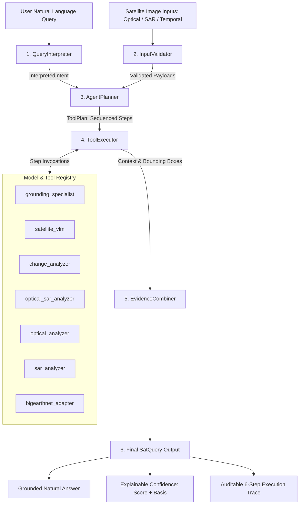

# SatQuery AI — Agentic Orchestration & Model/Tool Registry (Chunk 11)

## 1. Overview & SIH Problem Statement 26167 Context
SatQuery AI addresses Smart India Hackathon (SIH) Problem Statement 26167:
> *"An Interactive Vision-Language Assistant for Multimodal Remote Sensing Image Analysis through Text Queries"*

To fulfill the vision of an interactive assistant capable of tackling diverse, complex satellite tasks without hardcoded assumptions, **Chunk 11 introduces an autonomous Agentic Orchestration Layer** powered by a unified **Model & Tool Registry**. 

The system accepts free-form natural language queries over multimodal remote sensing inputs (optical Sentinel-2, SAR Sentinel-1, or bi-temporal pairs) and automatically:
1. Disambiguates user intent across 8 specialized remote sensing categories.
2. Performs strict schema and modality validation with informative error codes.
3. Formulates a deterministic or multi-step execution plan (`ToolPlan`).
4. Selects and sequences the optimal specialist tools from a 7-tool registry.
5. Executes the plan sequentially, passing forward intermediate spatial detections and bounding boxes.
6. Synthesizes cross-tool evidence into structured claims and a transparent, explainable confidence score.
7. Emits an end-to-end 6-step auditable execution trace.

---

## 2. System Architecture

---

## 3. Specialist Model & Tool Registry

All remote sensing tools are registered in [`backend/core/model_registry.py`](file:///c:/SIH_Project/backend/core/model_registry.py) with formal metadata including capability tags, input requirements, output schemas, and execution wrappers.

| Tool Name | Specialist Capabilities | Required Inputs | Primary Engine |
| :--- | :--- | :--- | :--- |
| `grounding_specialist` | Object grounding, spatial localization, bounding boxes, segmentation | `image`, `question` | Grounding DINO + SAM |
| `satellite_vlm` | Scene captioning, visual reasoning, VQA, natural-language explanation | `image`, `question` | BLIP Remote Sensing VLM |
| `change_analyzer` | Bi-temporal change detection, Change-VQA, severity, mask generation | `image_t1`, `image_t2`, `query` | ChangeFormerV6 (LEVIR-CD) |
| `optical_sar_analyzer` | Dual-stream optical-SAR fusion, cross-modal verification | `image_optical`, `image_sar`, `query` | Dual-stream ResNet + Cross-Modal Fusion |
| `optical_analyzer` | Optical land-cover classification, NDVI estimation, multispectral analysis | `image`, `query` | ResNet50 Sentinel-2 Classifier |
| `sar_analyzer` | SAR surface roughness, water detection, all-weather penetration | `image_sar`, `query` | ResNet18 Sentinel-1 Classifier |
| `bigearthnet_adapter` | Multi-label land-cover classification, 19 Corine Land Cover classes | `image` (or pair), `query` | BigEarthNet Multi-Modal Adapter |

---

## 4. Query Intent Classification & Planning

The `QueryInterpreter` disambiguates user intent into one of 8 standardized classes:
1. `single_image_description`: Scene captioning, descriptive overviews.
2. `single_image_vqa`: Direct remote sensing question answering.
3. `object_grounding`: Spatial localization, bounding boxes, segmentation.
4. `bitemporal_change`: Bi-temporal change detection and Change-VQA.
5. `optical_sar_crossmodal`: Joint optical + SAR fusion analysis.
6. `optical_specific`: Visual land cover, NDVI, multispectral analysis.
7. `sar_specific`: Radar backscatter, moisture, surface roughness.
8. `complex_multitool`: Complex composite requests requiring sequential multi-tool plans.

### Multi-Tool Plan Sequencing
For complex or multi-stage questions (such as Change-VQA or Grounding + Description), `AgentPlanner` constructs sequential multi-step plans:
- **Change-VQA (e.g. "Has the built-up area increased?"):**
  - Step 1: `change_analyzer` computes pixel-level change ratio, severity, and categorical shifts.
  - Step 2: `satellite_vlm` incorporates the quantitative change evidence into high-level natural language reasoning.
- **Complex Grounding + VQA (e.g. "Locate solar panels and assess their operational density"):**
  - Step 1: `grounding_specialist` detects and localizes candidate solar panel bounding boxes.
  - Step 2: `satellite_vlm` receives the localized coordinates to answer the density query.

---

## 5. Input Validation & Strict Error Rejection

The `InputValidator` (`backend/core/input_validator.py`) enforces strict validation prior to executing heavy neural models:
- **`MISSING_TEMPORAL_IMAGE`**: Raised with HTTP 400 when bi-temporal change queries lack either `image_t1` or `image_t2`.
- **`MISSING_SAR_IMAGE`**: Raised with HTTP 400 when cross-modal queries lack `image_sar`.
- **`EMPTY_QUESTION`**: Raised when query strings are null, blank, or whitespace.
- **`INVALID_IMAGE_PAYLOAD`**: Raised when image strings fail Base64 decoding.
- **`INVALID_IMAGE_FORMAT`**: Raised when decoded payloads are not valid image files.

---

## 6. Transparent, Explainable Confidence Aggregation

Rather than presenting an uninterpretable single number or simulated score, `EvidenceCombiner` computes an explainable composite confidence:
$$\text{Score} = \text{clip}\left(\frac{1}{N} \sum_{i=1}^N c_i + \text{bonus}_{\text{multi-tool}} - \text{penalties}_{\text{errors}}, \, 0.20, \, 0.98\right)$$

- **`score`**: Normalized float between 0.20 and 0.98.
- **`label`**: Qualitative binning (`very_high`, `high`, `moderate`, `low`).
- **`basis`**: An explicit array of verifiable contributing factors (e.g., `"Grounding specialist localized 1 region(s)"`, `"ChangeFormer detected 56.58% change with significant severity"`, `"Multi-tool plan executed 2/2 steps successfully"`).

---

## 7. Auditable Execution Trace

Every request generates a 6-step execution trace accessible via the API and displayed in the frontend:
1. `query_interpretation`: Target intent, modalities, temporal requirement, extracted keywords.
2. `input_validation`: Validation result and payload format checks.
3. `tool_selection`: Generated plan ID, selected tools, and architectural justification.
4. `tool_execution`: Step-by-step latency, status, executed and failed tools.
5. `evidence_combination`: Extracted physical claims and aggregated confidence score.
6. `answer_generation`: Status of final grounded synthesis.

---

## 8. Real End-to-End Evaluation Results

Verified against authentic remote sensing samples (`backend/evaluation_results/chunk11_e2e_results.json`):

| Test ID | Representative Query | Interpreted Intent | Tools Executed | Confidence | Latency | Status |
| :--- | :--- | :--- | :--- | :--- | :--- | :--- |
| **A** | *"Describe the land-cover and major objects visible in this image."* | `single_image_description` | `satellite_vlm` | 0.88 (`very_high`) | 17.3s | ✅ Success |
| **B** | *"Highlight the water body referred to in the query."* | `object_grounding` | `grounding_specialist` | 0.60 (`moderate`) | 52.4s | ✅ Success |
| **C** | *"What changed between these two dates?"* | `bitemporal_change` | `change_analyzer`, `satellite_vlm` | 0.94 (`very_high`) | 49.0s | ✅ Success |
| **D** | *"Use the optical and SAR images together to identify built-up and water-covered regions."* | `optical_sar_crossmodal` | `optical_sar_analyzer` | 0.85 (`high`) | 77 ms | ✅ Success |
| **E** | *"Has the built-up area increased, decreased, or remained unchanged?"* | `bitemporal_change` | `change_analyzer`, `satellite_vlm` | 0.94 (`very_high`) | 57.7s | ✅ Success |

All 5 test cases succeeded with 6/6 trace steps logged and transparent confidence breakdowns.
